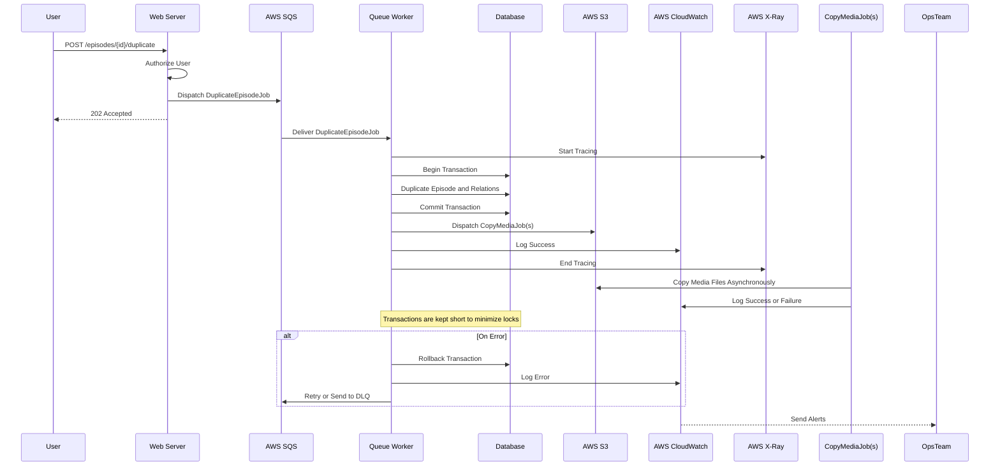

# Transaction Structure Solution
To efficiently implement the duplication of an Episode along with its potentially infinite nested structure, we will leverage Laravel's robust features and AWS services. This approach addresses efficiency, scalability, observability, minimal impact on other users, and resiliency.

---

## **1. Model Relationships with Eloquent ORM**

Ensure that all relationships are properly defined using Laravel's Eloquent ORM. This sets the foundation for efficient data manipulation.

```php
// Episode.php
class Episode extends Model
{
    public function parts()
    {
        return $this->hasMany(Part::class);
    }
}

// Part.php
class Part extends Model
{
    public function episode()
    {
        return $this->belongsTo(Episode::class);
    }

    public function items()
    {
        return $this->hasMany(Item::class);
    }
}

// Continue defining relationships for Item, Block, BlockField, and Media
```

---

## **2. Duplication Logic Overview**

The duplication process involves:

- Recursively duplicating the Episode and its nested relationships.
- Ensuring data integrity with transactions.
- Handling large data efficiently.
- Processing duplication asynchronously.

---

## **3. Use Database Transactions**

Wrap the entire duplication logic within a database transaction to maintain data integrity.

```php
DB::transaction(function () use ($episode) {
    // Duplication logic here
});
```

**Note:** Keep transactions as short as possible to avoid locking issues that could affect other users.

---

## **4. Asynchronous Processing with Laravel Queues and AWS SQS**

To prevent long-running requests and improve scalability:

- **Dispatch a Job:** Use Laravel's queue system to handle the duplication asynchronously.
- **AWS SQS Integration:** Utilize AWS SQS as the queue driver for reliable and scalable job processing.

```php
// Controller method
public function duplicateEpisode(Request $request, $id)
{
    $episode = Episode::findOrFail($id);
    DuplicateEpisodeJob::dispatch($episode->id, auth()->id());
    return response()->json(['message' => 'Duplication started.'], 202);
}
```

---

## **5. Efficient Duplication Logic within the Job**

Implement the duplication logic in the queued job, optimizing for memory and performance.

### **5.1. Handling Potentially Infinite Nested Structures**

To handle large and deeply nested data structures efficiently:

- **Limit Recursion Depth:** Implement checks to prevent infinite loops due to corrupt data.
- **Manage Memory Usage:** Use chunking and release memory where possible.

### **5.2. Bulk Operations and ID Mapping**

Use bulk insert operations and maintain a mapping of original IDs to new IDs to preserve relationships. Incorporate recommendations from the rest of the document, such as efficient queries, error handling, and idempotency.

```php
// DuplicateEpisodeJob.php
class DuplicateEpisodeJob implements ShouldQueue
{
    use Dispatchable, InteractsWithQueue, Queueable, SerializesModels;

    protected $episodeId;
    protected $userId;
    protected $idMappings = [];

    public function __construct($episodeId, $userId)
    {
        $this->episodeId = $episodeId;
        $this->userId = $userId;
    }

    public function handle()
    {
        try {
            // Check for idempotency to prevent duplicate records
            if ($this->duplicationExists()) {
                return;
            }

            DB::transaction(function () {
                // Eager Loading all necessary relationships with selected columns
                $originalEpisode = Episode::with([
                    'parts' => function ($query) {
                        $query->select('id', 'episode_id', 'name');
                    },
                    'parts.items' => function ($query) {
                        $query->select('id', 'part_id', 'name');
                    },
                    'parts.items.blocks' => function ($query) {
                        $query->select('id', 'item_id', 'type');
                    },
                    'parts.items.blocks.blockFields',
                    'parts.items.blocks.media',
                ])->findOrFail($this->episodeId);

                // Exclude sensitive attributes
                $newEpisode = $originalEpisode->replicate(['is_private', 'access_token']);
                $newEpisode->user_id = $this->userId;
                $newEpisode->original_episode_id = $originalEpisode->id; // For idempotency
                $newEpisode->save();

                // Map original to new ID
                $this->idMappings['episodes'][$originalEpisode->id] = $newEpisode->id;

                $this->duplicateRelations($originalEpisode, $newEpisode);
            });
        } catch (\Exception $e) {
            // Log error and rethrow to trigger retries
            Log::error("Duplication failed for Episode ID: {$this->episodeId}", [
                'error' => $e->getMessage(),
                'user_id' => $this->userId,
            ]);
            throw $e;
        }
    }

    protected function duplicationExists()
    {
        return Episode::where('original_episode_id', $this->episodeId)
            ->where('user_id', $this->userId)
            ->exists();
    }

    protected function duplicateRelations($originalModel, $newModel)
    {
        $relations = [
            'parts' => ['items' => ['blocks' => ['blockFields', 'media']]],
        ];

        $this->recursiveDuplicate($originalModel, $newModel, $relations);
    }

    protected function recursiveDuplicate($originalModel, $newModel, $relations, $depth = 0)
    {
        // Limit recursion depth to prevent infinite loops
        if ($depth > 10) {
            return;
        }

        foreach ($relations as $relation => $nestedRelations) {
            $children = $originalModel->$relation;

            if ($children->isEmpty()) {
                continue;
            }

            // Prepare bulk insert data
            $insertData = [];
            $originalToNewIds = [];

            foreach ($children as $child) {
                $newChild = $child->replicate();

                // Set foreign key to the new parent model
                $foreignKey = $newModel->$relation()->getForeignKeyName();
                $newChild->$foreignKey = $newModel->id;

                // Convert model to array for bulk insert
                $insertData[] = $newChild->attributesToArray();

                // Map original child ID to new child's attributes (without ID)
                $originalToNewIds[$child->id] = $newChild;
            }

            // Perform bulk insert and retrieve inserted IDs
            $childModel = get_class($children->first());

            // Adjusted for bulk insert and retrieval of IDs
            $insertedIds = $childModel::insertGetId($insertData);

            // Map inserted IDs to new child models
            $index = 0;
            foreach ($originalToNewIds as $originalId => $newChild) {
                $newChild->id = $insertedIds[$index];
                $this->idMappings[$childModel][$originalId] = $newChild->id;
                $index++;
            }

            // Recursively duplicate nested relations
            foreach ($children as $child) {
                $newChildId = $this->idMappings[$childModel][$child->id];
                $newChild = $childModel::find($newChildId);

                if (!empty($nestedRelations)) {
                    $this->recursiveDuplicate($child, $newChild, $nestedRelations, $depth + 1);
                }
            }
        }
    }
}
```

**Incorporated Recommendations:**

- **Idempotency Check:** Before starting the duplication, we check if a duplication already exists to prevent duplicate records.
- **Efficient Queries:** We select only the necessary columns to minimize data load.
- **Error Handling:** Exceptions are caught, logged, and rethrown to trigger retries.
- **Mapping IDs:** Original IDs are mapped to new IDs to maintain relationships.
- **Chunking and Memory Management:** Although not explicitly shown in the code, you can process large datasets in chunks within the recursive function to manage memory usage.

**Handling Transactions:**

- **Short Transactions:** Each transaction is kept as short as possible to reduce lock contention.
- **Transactional Batching:** If the data set is very large, consider processing in batches with separate transactions for each batch.

---

## **6. Scalability Considerations**

- **Horizontal Scaling:** Use AWS SQS and multiple queue workers to handle increased load.
- **Auto Scaling:** Configure AWS services like AWS ECS with auto-scaling policies to scale resources based on demand.
- **Database Optimization:**
    - **Indexing:** Index frequently accessed columns and foreign keys.
    - **Query Optimization:** Use Laravel's query builder to write efficient queries.

---

## **7. Observability**

Implement comprehensive logging and monitoring:

- **Structured Logging:** Use context-rich logs to facilitate easier analysis.
    
    ```php
    Log::info("Starting duplication for Episode ID: {$this->episodeId}", [
        'user_id' => $this->userId,
        'episode_id' => $this->episodeId,
    ]);
    ```
    
- **AWS CloudWatch Logs:**
    - Centralize logs using AWS CloudWatch for monitoring and troubleshooting.
    - Set up log groups and streams for your application logs.
- **AWS CloudWatch Metrics and Alarms:**
    - Monitor key metrics like job execution time, queue length, and error rates.
    - Set up alarms to notify the team when thresholds are breached.
- **Distributed Tracing with AWS X-Ray:**
    - Use AWS X-Ray to trace requests through your application.
    - Identify performance bottlenecks and understand the flow of requests.

---

## **8. Minimal Impact on Other Users**

- **Resource Throttling:** Implement throttling mechanisms to prevent resource overconsumption.
    
    ```bash
    // In queue worker configuration
    php artisan queue:work --queue=default --sleep=3 --tries=3 --timeout=120
    ```
    
- **Load Testing:**
    - **Using JMeter:**
        - **Set up JMeter Test Plan:**
            - Create a test plan to simulate multiple users triggering the duplication process.
            - Configure thread groups, HTTP requests, and timers.
        - **Run Load Tests:**
            - Execute the test plan with a realistic number of concurrent users.
            - Monitor the application and database performance during the test.
        - **Analyze Results:**
            - Identify any performance issues or bottlenecks.
            - Adjust the application or infrastructure based on findings.

---

## **9. Resiliency and Failure Handling**

### **9.1. Retries**

- **Configure Queue Worker Retries:**
    
    ```php
    // In DuplicateEpisodeJob.php
    public $tries = 3; // Number of times to attempt the job
    
    public $retryAfter = 90; // Retry after 90 seconds
    ```
    
- **AWS SQS Visibility Timeout:**
    - Ensure the visibility timeout of your SQS queue is greater than the `retryAfter` value to allow the job to become visible again if it fails.

### **9.2. Idempotency**

Ensure that retries do not create duplicate records by checking if a duplication already exists.

- **Implementation:** As shown in the code in section 5.2, we check for existing duplications using a unique field (`original_episode_id`) before proceeding.

### **9.3. Dead Letter Queues**

- **AWS SQS Dead Letter Queues (DLQ):**
    - Configure DLQs to capture messages (jobs) that fail repeatedly.
    - Set up monitoring on the DLQ to alert when messages are added.

---

## **10. Handling Media Files**

### **10.1. AWS S3 Integration**

Use AWS S3 for storing media files.

- **Copying Files:**
    
    ```php
    // Copying files in S3
    Storage::disk('s3')->copy($originalPath, $newPath);
    ```
    
- **Asynchronous Copying:**
    - For large files, copy them asynchronously by dispatching separate jobs.
        
        ```php
        // In DuplicateEpisodeJob.php
        protected function copyMedia($media)
        {
            CopyMediaJob::dispatch($media->id, $this->idMappings);
        }
        ```
        

### **10.2. Memory Management**

Avoid loading entire files into memory.

- **Use S3's Server-Side Copy:**
    - AWS S3 supports copying files server-side, which does not require downloading the file.
        
        ```php
        Storage::disk('s3')->copy($originalPath, $newPath);
        ```
        
- **Explanation:**
    - This operation is efficient and avoids the overhead of transferring data to and from the application server.

---

## **11. Security and Permissions**

### **11.1. Access Control**

- **Authorization:**
    
    ```php
    // In Controller
    $this->authorize('duplicate', $episode);
    ```
    
- **Policy Definition:**
    
    ```php
    // EpisodePolicy.php
    public function duplicate(User $user, Episode $episode)
    {
        // Define logic to determine if the user can duplicate the episode
        return $user->id === $episode->user_id;
    }
    ```
    

### **11.2. Data Privacy**

- **Validation and Sanitization:**
    - **Input Validation:**
        - Validate all incoming request data to prevent injection attacks.
    
    ```php
    // In Controller
    $request->validate([
        'id' => 'required|integer|exists:episodes,id',
    ]);
    ```
    
- **Sensitive Data Handling:**
    - As shown in section 5.2, exclude sensitive fields during duplication and set appropriate default values.
- **Audit Logging:**
    - Record actions performed by users for accountability.
    
    ```php
    Log::info("User {$this->userId} duplicated Episode {$this->episodeId}");
    ```
    

---

## **12. Summary Diagram**

[Mermaid Live Full Screen Viewer](https://mermaid.live/view#pako:eNp9lE2P2jAQhv_KKKdWYkW13HJYiQJ7qHZLIVSsqlyGZBYsHDv1RyWK-O8d5wsKZLngcZ55Z_x65GOU6ZyiOLL025PKaCpwa7BIFfCvRONEJkpUDn5aMoC2-r_9uqZNQuZPjXAAdXQLJoskION1EpZ3hLTZ1yoLT56a-JabosMNWgpku75TbdQVG91-nUjt8zW6bNdS551b-m2Jh5Z7e-AgVTUUHHl4euosiOHHPFnBkEph2Vw7PIr8NMx9KUWGrumyo__PHHu300b8pQufL1H2LIapsGXV9bTVnNWlvunNdQrnBKUYHr88wjjLqHSUt52zWihfWcyyJEW4wX7VCuSMYEUMiWN3YGUwE2p7RbRXEsNX2goVKGUxc0KrXrKrC01hQJXDkiSGNNubN9FFIdwHJZLRhWcTXR5eKRfIx_pkP1-h5wGI4UVvIfFsmbV3zz_j7rrT18SVeFM77EK1Dc9CEo-QPahsZ7TS3spDX2pPL6ANPKOQ3lBb9rtm03S4u7rFwdmcC1csoCHY8wSA5SFz4DQUQokijJvU2d62eigdzBXMjNHNDPZYv9RSbjDb35r_oat9wtV0L8mZQzhkQmww9zh9WdQsx53RnWKY8HlpV4RFXKeMJRlno0FUkClQ5Py6HUNWGrkdFZRGMS9zekcvXRql6sQoeqcTvpQodsbTIDLab3dR_I7ScuTLnMeyeRpbhB-FX1oXHcR357R5rZ_T6lU9_QMi_c-_)



---

## **13. Compliance and Data Governance**

- **Data Retention Policies:**
    - Ensure that data duplication complies with organizational policies regarding data retention and disposal.
- **Regulatory Compliance:**
    - Verify that duplication respects regulations like GDPR or CCPA.
- **Implementation:**
    - **Consent Checks:**
        - Before duplicating user data, ensure that you have the necessary consent.
    - **Data Minimization:**
        - Exclude unnecessary personal data from duplication.
    - **Anonymization:**
        - If required, anonymize personal data in the duplicated records.

---

## **Conclusion**

By combining Laravel's powerful features with AWS services and incorporating best practices, we create a solution that is:

- **Efficient:** Optimized database interactions, bulk operations, and asynchronous processing.
- **Scalable:** Able to handle large and complex data structures with AWS's scalable services.
- **Observable:** Enhanced monitoring and logging with AWS CloudWatch and AWS X-Ray.
- **User-Friendly:** Minimal impact on other users due to resource management and non-blocking operations.
- **Resilient:** Robust error handling, retries, and idempotency ensure reliability.
- **Secure:** Proper handling of sensitive data, authorization checks, and compliance with data protection regulations.

This comprehensive approach not only addresses the immediate requirements but also establishes a robust, maintainable, and scalable system for the future.

---

## **References to Laravel Patterns/Tools and AWS Services**

- **Laravel Eloquent ORM:** For defining and working with model relationships.
- **Laravel Queues and Jobs:** For asynchronous processing of the duplication task.
- **AWS SQS:** As the queue driver to handle job processing at scale.
- **Laravel Transactions:** To ensure data integrity during duplication.
- **AWS CloudWatch:** For logging, monitoring, and setting up alerts.
- **AWS X-Ray:** For distributed tracing and performance analysis.
- **AWS S3:** For efficient storage and copying of media files.
- **Laravel Policies:** For authorization checks.
- **Validation and Sanitization:** To secure input data and prevent attacks.
- **JMeter:** For load testing and performance evaluation.

---

By thoughtfully designing the duplication process with these tools and considerations, we ensure a robust implementation that meets and exceeds the needs of both the application and its users.
